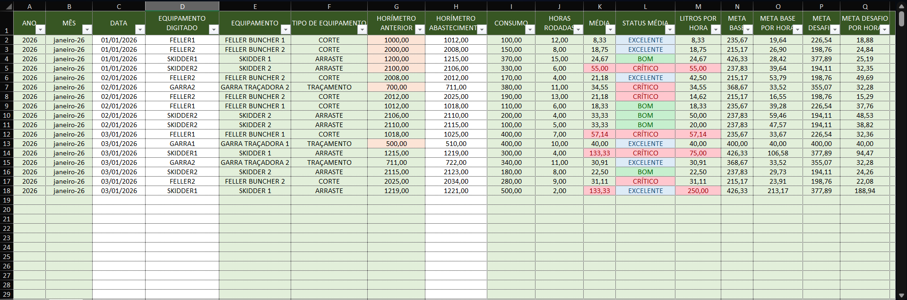
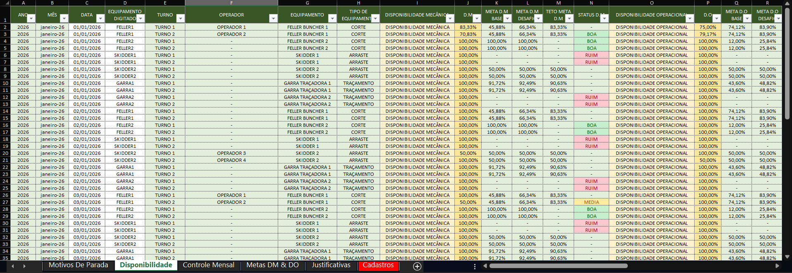

# 📊 Operational Production Spreadsheet

This repository contains a **demonstration spreadsheet model** designed to support operational production tracking, planning, consumption control, and machine availability monitoring.

The structure was created to organize daily operational data and transform it into **clear indicators**, supporting monitoring, control, and forecasting based on real operational logic.

⚠️ **All data used in this project is fictional and for demonstration purposes only.**  
Some labels and sheet names are in **Portuguese**, reflecting the original operational context and real-world usage.

---

## 🎯 Project Objective

To centralize operational data and provide:
- Visibility of production progress
- Control of operational execution
- Monitoring of consumption and availability indicators
- Forecasts based on real operational rhythm
- Support for decision-making through structured indicators

---

## 🧩 Spreadsheet Structure

The project is organized into **operational modules**, each focused on a specific set of indicators.

---

## 📁 Repository Structure

- **Production Control Spreadsheet**
  - Tracks daily production by machine
  - Supports productivity analysis over time

- **Fuel & Lubricants Control Spreadsheet**
  - Diesel consumption monitoring
  - Lubricants usage tracking
  - Helps identify inefficiencies and abnormal consumption patterns

- **Indicators & Metrics**
  - Mechanical Availability (DM)
  - Operational Availability (DO)
  - Relationship between maintenance, availability, and production

---

## 📌 Key Concepts

### 🔧 Mechanical Availability (DM)
**Mechanical Availability (DM)** represents the percentage of time a machine is mechanically able to operate, considering failures and corrective maintenance.

> DM indicates how reliable the equipment is from a mechanical standpoint.

### ⚙️ Operational Availability (DO)
**Operational Availability (DO)** represents the percentage of time a machine is actually available for operation, considering mechanical availability, operational delays, and other non-mechanical stoppages.

> DO reflects how much the machine is truly available for production in real operating conditions.

---

## 📦 Production Module

The **Production module** is responsible for tracking daily production and transforming raw data into operational indicators.

### 🔹 BDTs (Daily Production Records)
- Daily production records by operator
- Acts as the raw data input layer for the entire structure

### 🔹 Stock & Stock Control
- Organizes produced volume by:
  - Farm
  - Project
  - Stand (Talhão)
- Provides a clear view of completed and ongoing production

### 🔹 Stand Registration (Cadastro de Talhão)
- Centralized registration of all stands to be worked
- Contains key information reused across other sheets
- Ensures data consistency throughout the model

### 🔹 Volume x Rhythm
- Controls the start of each project
- Uses production rhythm and accumulated volume
- Automatically estimates **expected completion dates** for:
  - Cutting
  - Skidding (Arraste)
  - Processing (Traçamento)

### 🔹 VMI (Production Targets by Production Type)
- Tracks production goals by **production type**
- Each VMI is monitored individually
- Calculations are fully formula-based, using recorded production data

### 🔹 Production Targets (Metas de Produção)
- Tracks production goals by **individual machine**
- Uses VMI ranges instead of individual VMIs
- Provides a machine-level performance view

---

## ⛽ Consumption Module (Diesel & Lubricants)

The **Consumption module** focuses on monitoring **machine fuel and lubricant consumption**, providing indicators that support cost control and operational efficiency.

Unlike production targets, consumption targets are based on **reduction factors**, where the goal is to consume **less than a defined reference value**.

### 🔹 Diesel
- Controls diesel input and output for machines and fuel trucks (comboios)
- Centralizes daily diesel consumption data by machine
- Acts as the raw data layer for diesel indicators

### 🔹 Lubricants
The lubricants control follows the same logic as diesel, with individual sheets for each lubricant type:
- Grease
- 15W40
- Hydraulic Oil 68

Each sheet:
- Controls lubricant input and output by machine
- Allows independent tracking per lubricant type

> ⚠️ The lubricants section is **fully scalable** and can be expanded to include as many lubricant types as required, based on machine configuration and client needs.

### 🔹 Diesel Target (Meta Diesel)
- Defines diesel consumption targets
- Uses **reduction factors** instead of growth factors
- Compares actual consumption against target consumption

### 🔹 Lubricants Target (Meta Lubrificantes)
- Defines consumption targets for lubricants
- Applies the same reduction-based logic used in diesel targets
- Provides a consolidated view of lubricant consumption performance

---

## ⏱️ Availability Module (DM & DO)

The **Availability module** is designed to monitor **machine availability and downtime**, transforming stop records into daily and monthly availability indicators.

As with other modules, all calculations are based on **real data entries**, and availability targets use **reduction factors**, aiming to reduce downtime hours over time.

### 🔹 Downtime Reasons (Motivos de Parada)
- Base data sheet for DM and DO calculations
- Records downtime by:
  - Date
  - Machine
  - Operator
  - Downtime duration
  - Downtime reason code

### 🔹 Availability
- Calculates **DM and DO availability**
- Results are available:
  - Daily
  - By shift
  - Per machine

### 🔹 Monthly Control
- Consolidates DM and DO indicators on a **monthly basis**
- Supports long-term monitoring and performance comparison

### 🔹 DM & DO Targets (Metas de DM e DO)
- Defines availability targets using **reduction factors**
- Focuses on reducing total downtime hours
- Compares actual downtime against target values

### 🔹 Justifications
- Database of justifications linked to downtime reason codes
- Ensures standardization and clarity in downtime classification

> ⚠️ The downtime reasons and justifications database is **fully scalable**, allowing the inclusion of as many reason codes as required, based on operational complexity and client needs.

---

## 🛠️ Tools & Skills Applied
- Excel (advanced formulas)
- Indicator and KPI logic
- Data organization
- Operational process understanding
- Analytical and structured thinking

---

## 📈 Project Status
This repository represents the **first stage** of a larger operational metrics structure.

Future iterations may include:
- Integrated dashboards
- Cost and performance analysis
- Cross-module indicators
- Additional operational modules

---

## 📊 Dashboards & Spreadsheets

### BDTs

### Stock

### VMI – Production Target Calculation

### Diesel Consumption

### Lubricant Consumption (15W40)

### Diesel Target

### Lubricants Target

### Availability (DM & DO)

### Availability Targets

### Downtime Details

## 👤 Author

Developed by **Gabriel Henrique**  
Computer Science student | Data, Game Development & Systems Enthusiast  
Focused on connecting **technology, data, and real-world operations**
