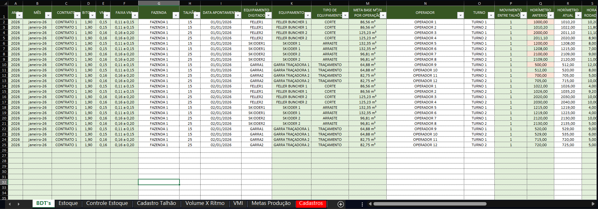
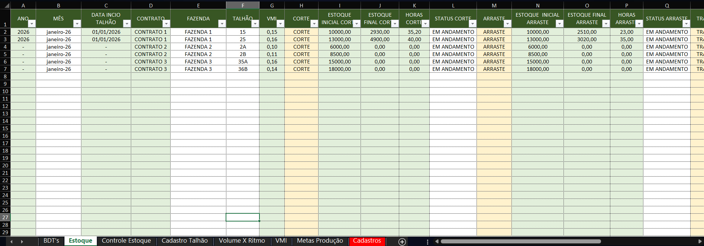
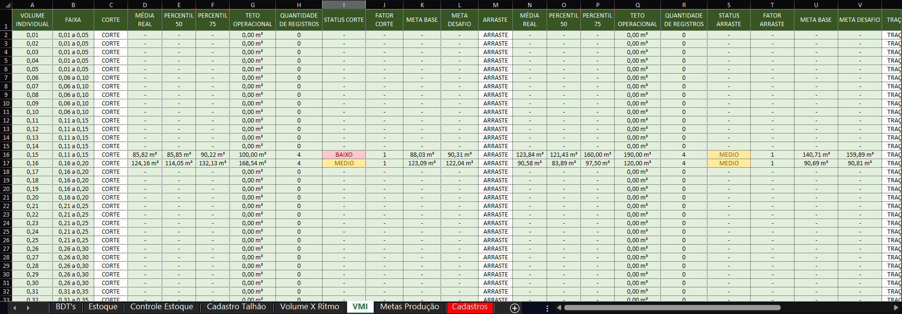

# 📊 Operational Production Spreadsheet

This repository contains a **demonstration spreadsheet model** designed to support operational production tracking and planning.

The structure was created to organize daily production data and transform it into **clear indicators**, supporting monitoring, control, and production forecasting.

⚠️ **All data used in this project is fictional and for demonstration purposes only.**  
Some labels and sheet names are in **Portuguese**, reflecting the original operational context and real-world usage.

---

## 🎯 Project Objective

To centralize production-related data and provide:
- Visibility of production progress
- Control of operational execution
- Forecasts based on real production rhythm
- Support for decision-making through structured indicators

---

## 🧩 Spreadsheet Structure (Production Module)

The current version includes the **Production module**, composed of the following sheets:

### 🔹 BDTs (Daily Production Records)
- Daily production records by operator
- Acts as the raw data input layer for the entire structure

### 🔹 Stock & Stock Control
- Organizes produced volume by:
  - Farm
  - Project
  - Stand (Talhão)
- Provides a clear view of completed and ongoing production

### 🔹 Stand Registration (Cadastro de Talhão)
- Centralized registration of all stands to be worked
- Contains key information used across other sheets
- Ensures data consistency throughout the model

### 🔹 Volume x Rhythm
- Controls the start of each project
- Uses production rhythm and accumulated volume
- Automatically estimates **expected completion dates** for:
  - Cutting
  - Skidding (Arraste)
  - Processing (Traçamento)

### 🔹 VMI (Production Targets by Production Type)
- Tracks production goals by **production type**
- Each VMI is monitored individually
- Calculations are fully formula-based, using recorded production data

### 🔹 Production Targets (Metas de Produção)
- Tracks production goals by **individual machine**
- Uses VMI ranges instead of individual VMIs
- Provides a machine-level performance view

---

## 🛠️ Tools & Skills Applied
- Excel (advanced formulas)
- Indicator logic
- Data organization
- Operational process understanding
- Analytical thinking

---

## 📈 Project Status
This repository represents the **first stage** of a larger operational metrics structure.  
Additional modules (e.g., consumption, availability, dashboards) may be added in future iterations.

## 📊 Dashboards & Spreadsheets

### BDTs

### Stock

### VMI – Meta Calculation

